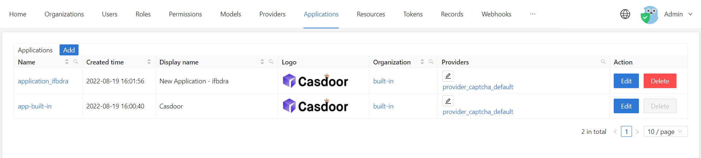
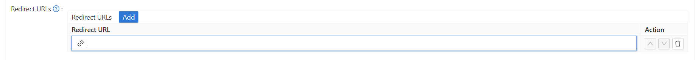
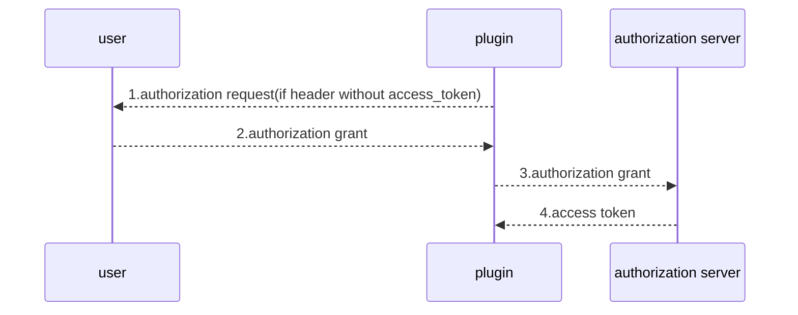

# casdoor-nginx-module
This is an nginx gateway plugin based on openresty. We will show you the steps below.

## What you need

The Casdoor should be deployed.

You can refer to the Casdoor official documentation for the [install guide](https://casdoor.org/docs/basic/server-installation). 

## Quickstart

### Step1: Install Openresty

The following is a demo of the source code installation of version 1.21.4.1. If you want other installation methods or versions, click [other](https://openresty.org/en/download.html) learn more. 

You should have perl 5.6.1+, libpcre, libssl installed into your system. For Linux, you should also ensure that ldconfig is in your PATH environment.Execute the following command to extract and install.

``` shell
yum install pcre-devel openssl-devel gcc curl
wget https://openresty.org/download/openresty-1.21.4.1.tar.gz
tar -xvf openresty-1.21.4.1.tar.gz
cd openresty-1.21.4.1
./configure 
make
make install
```

Openresty is installed in the /usr/local directory by default. 
Enter the /usr/local/openresty directory. If you see bin, nginx and other files, it means that the Openresty is installed.

### Step2: Install plugin && resty.http dependence

Download plugin from github.

``` shell
git clone https://github.com/casdoor/casdoor-nginx-module.git
cd casdoor-nginx-module
# Put the plugin directory in the /usr/local/openresty/lualib directory
mv auth_plugin /usr/local/openresty/lualib

git clone https://github.com/pintsized/lua-resty-http.git
cd lua-resty-http
mv http_connect.lua /usr/local/openresty/lualib/resty/
mv http_headers.lua /usr/local/openresty/lualib/resty/
mv http.lua /usr/local/openresty/lualib/resty/
```

### Step3: Configure plugin

```shell
cd /usr/local/openresty/lualib/auth_plugin
vim conf.lua

-- url for authorization
config.redirectUrl = "http://localhost:port/login/oauth/authorize?client_id=Client_id&redirect_uri=RedirectURL&response_type=code&scope=openid&state=STATE"

-- URIs in the white_uri don't need authentication
config.white_uri = {"/api/user/login"}

-- Request path to get accesstoken
config.access_url = "http://localhost:port/api/login/oauth/access_token"

config.grant_type = "authorization_code"

config.client_id = "client_id"

config.client_secret = "client_secret"

-- Request timeout
config.timeout = 10000
```

### Step4: Configure nginx

```shell
vim /usr/local/openresty/nginx/conf/nginx.conf
#Configure nginx gateway path
location /api {
            default_type "text/html";
            access_by_lua_file /usr/local/openresty/lualib/auth_plugin/api_access.lua;
            content_by_lua_file /usr/local/openresty/lualib/auth_plugin/api_content.lua;
}
```

### Step5: Configure Casdoor redirect url

Start the front end and back end of Casdoor.

Open your favorite browser and visit **[http://localhost:8000](http://localhost:8=8000/)** and login with the default user name(admin) and password(123), you will see the following:



click the Edit button, input your Redirect URLs. After authorization, you will redirect to this URL.




### plugin workflow



